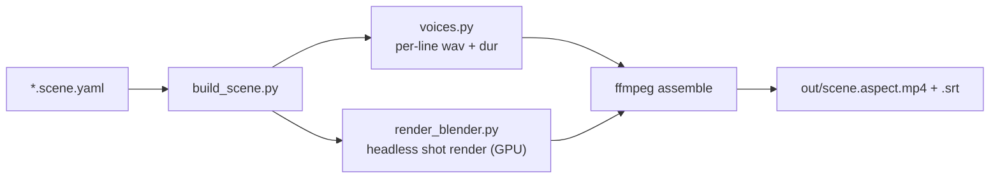
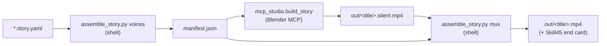

# anim-studio

[](LICENSE)
[](https://www.blender.org/)

An **agent-automatable 3D animation studio** (Blender + Python). You write a story as a small YAML
file; the pipeline synthesizes each line as speech (a cloned voice and/or a Hindi female voice),
renders the shots headless on the GPU, and stitches a captioned, voiced video — no manual editing.
It follows a simple `schema → render → voice → mux` contract.

Two ways to drive it: a **subprocess pipeline** for rigged body-motion characters, and a
**plug-any-agent live-MCP pipeline** for talking-head characters with working lip-sync — so a local
or cloud LLM agent can produce a video from one story file. See [Two pipelines](#two-pipelines).

## Status: M2 — real characters, doing their roles
"The Upgrade" scene (16:9): two rigged Quaternius characters (Riya + Ram) on a bench in a garden (HDRI),
clothed (mesh-painted shirt + skirt/shorts), each playing a role-appropriate animation clip, two voices
timed to the dialogue, concatenated into one captioned video. (Lip-sync is M3 — mouths don't match words
yet.)

## At a glance



See [`docs/ARCHITECTURE.md`](docs/ARCHITECTURE.md) for the full pipeline, voice routing, renderer
internals, and gotchas — and [`scene.schema.md`](scene.schema.md) for the input format.

## Two pipelines

There are now **two ways to make a video** — pick by the kind of character:

| Pipeline | Characters | Driver | Lip-sync | Entry |
|----------|-----------|--------|----------|-------|
| **Subprocess** (this README) | rigged Quaternius / VRM, body-motion | `build_scene.py` (headless Blender subprocess) | none (M3 WIP) | `*.scene.yaml` |
| **Live-MCP story** | our own primitive `.blend`s (Ram/Riya), talking heads | an **agent** driving Blender over the MCP + 2 shell stages | amplitude (working) | `*.story.yaml` |

The live-MCP path is a **plug-any-agent** pattern: hand any agent (local or cloud) a `*.story.yaml`
and it produces a voiced, lip-synced video by following one doc — see
[`agent/AGENT_PLAYBOOK.md`](agent/AGENT_PLAYBOOK.md). It reuses this project's `voices.py` + ffmpeg
mux + the Skill45 end card.



## Prerequisites
- **Blender 4.5+** (default Windows path `C:\Program Files\Blender Foundation\Blender 4.5\blender.exe`;
  override with `SKILL45_BLENDER`). An NVIDIA GPU with OptiX/CUDA is preferred; EEVEE also renders on
  modest hardware.
- **Two Python (conda) envs** — the two voice models can't co-install:
  - `skill45video` — runs `build_scene.py` / `voices.py` / the agent host stages; has Orpheus, ffmpeg, numpy.
  - `genai` — runs the dots.tts clone as a subprocess (`make_voice.py`).
- **ffmpeg / ffprobe**. Tool paths are overridable via `SKILL45_FFMPEG` / `SKILL45_FFPROBE` /
  `SKILL45_DOTS_PYTHON` / `SKILL45_BLENDER` env vars (see `agent/check_tools.py`).
- **Assets are not bundled** (they're CC0/third-party and `.gitignore`d) — download them yourself; see
  [Acknowledgements](#acknowledgements) for sources and [`docs/CHARACTER_PIPELINE.md`](docs/CHARACTER_PIPELINE.md).

## Quickstart (run with the skill45video python)
```powershell
cd path/to/anim-studio          # your repo checkout
$env:PYTHONUTF8 = "1"

# full scene -> out/upgrade.opening.16x9.mp4 (+ .srt)
python build_scene.py stories/upgrade.opening.scene.yaml

# one shot, fast iteration
python build_scene.py stories/upgrade.opening.scene.yaml --only b3_reveal

# override aspect(s)
python build_scene.py stories/upgrade.opening.scene.yaml --aspects 16x9
```

M0 single-model mode (one rigged model, its own clip — still works):
```powershell
& "C:\Program Files\Blender Foundation\Blender 4.5\blender.exe" --background `
    --python render_blender.py -- `
    --model assets/characters/CesiumMan.glb --aspect 16x9 --seconds 6 --out out/proof
```

## Layout
```
build_scene.py             # orchestrator: synth voices -> render shots -> concat + mux + SRT
render_blender.py          # headless bpy renderer; shot-mode (--shot spec.json) + M0 mode (--model)
voices.py                  # voice router (Orpheus in-proc + dots subprocess) -> per-line wav + dur
make_voice.py              # dots.tts generation (run with the genai python)
scene.schema.md            # the *.scene.yaml input format (subprocess pipeline)
docs/ARCHITECTURE.md       # pipeline, voice routing, renderer internals, gotchas (mermaid)
agent/                     # LIVE-MCP STORY PIPELINE (plug-any-agent): AGENT_PLAYBOOK.md +
                           #   story.schema.md + mcp_studio.py + assemble_story.py + check_tools.py
stories/                   # *.scene.yaml (subprocess) + *.story.yaml (live-MCP) + story notes
characters/<stem>.face.json# per-character face metadata for the live-MCP lip-sync (small, tracked)
assets/characters/         # rigged .glb/.fbx + animation library (downloaded; gitignored)
assets/{motions,hdri,worlds,props}/
voice/                     # synthesized wavs + per-line text cache (gitignored)
out/                       # final mp4s + .srt;  out/_shots/ = per-shot silent mp4s + spec json (gitignored)
```

## Conventions
- HI dialogue is **Hinglish in Devanagari** (English terms transliterated: अपग्रेड/टेक/करियर) so Orpheus
  reads them.
- One scene = one set; shots are hard-cut and concatenated.

## Contributing
Issues and pull requests are welcome — see [`CONTRIBUTING.md`](CONTRIBUTING.md) for setup, the
capability self-test (`agent/check_tools.py`), and the coding conventions. The fastest way to verify a
change end-to-end is to run the `stories/ram_riya.story.yaml` example through the
[Agent Playbook](agent/AGENT_PLAYBOOK.md).

## License
[MIT](LICENSE) © DvaitAI. You may use, modify, and redistribute this code freely; attribution is
appreciated. The license covers **this repository's code and docs only** — not the third-party assets,
models, or tools below, which carry their own licenses.

## Acknowledgements
This project stands on excellent open work:

| Project | Use here | License |
|---------|----------|---------|
| [Blender](https://www.blender.org/) + `bpy` | rendering / scene authoring | GPL |
| [blender-mcp](https://github.com/ahujasid/blender-mcp) | live agent → Blender control (live-MCP path) | MIT |
| dots.tts | cloned-voice TTS (`dots` engine) | Apache-2.0 |
| Orpheus TTS | Hindi female voice (`orpheus` engine) | per upstream |
| [Quaternius](https://quaternius.com) | base bodies + animation library + outfits | CC0 |
| [Poly Haven](https://polyhaven.com) | HDRI environments | CC0 |
| [VRoid Studio](https://vroid.com/en/studio) + [VRM Add-on for Blender](https://vrm-addon-for-blender.info) | anime `.vrm` characters | per upstream |

Please respect each dependency's license when redistributing. Asset files are **not** included in this
repo; download them from the sources above.
