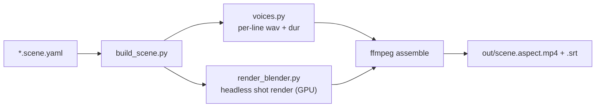

# anim-studio

In-house, **agent-automatable 3D virtual studio** (Blender + Python). You write a story as a
`*.scene.yaml`; the pipeline synthesizes each line in NK's cloned voice (and a Hindi female voice),
renders every shot headless on the GPU, and stitches a captioned video. Same `schema → render → voice →
mux` contract proven in `skill45-video`, now in 3D. Roadmap: `..\..\.claude\plans\mighty-jumping-wolf.md`.

## Status: M2 — real characters, doing their roles
"The Upgrade" scene (16:9): two rigged Quaternius characters (Riya + Ram) on a bench in a garden (HDRI),
clothed (mesh-painted shirt + skirt/shorts), each playing a role-appropriate animation clip, two voices
timed to the dialogue, concatenated into one captioned video. (Lip-sync is M3 — mouths don't match words
yet.)

## At a glance



See [`docs/ARCHITECTURE.md`](docs/ARCHITECTURE.md) for the full pipeline, voice routing, renderer
internals, and gotchas — and [`scene.schema.md`](scene.schema.md) for the input format.

## Prerequisites
- **Blender 4.5** at `C:\Program Files\Blender Foundation\Blender 4.5\blender.exe`
  (override with `SKILL45_BLENDER`). GPU: NVIDIA RTX PRO 3000 — OPTIX (preferred) / CUDA.
- **Two conda envs** (voice models don't co-install):
  - `skill45video` — runs `build_scene.py` / `voices.py`; has Orpheus, ffmpeg, numpy, manim.
  - `genai` — runs the dots.tts clone as a subprocess (`make_voice.py`).
- ffmpeg / ffprobe (in the `skill45video` env). Paths overridable via `SKILL45_FFMPEG` / `SKILL45_FFPROBE`
  / `SKILL45_DOTS_PYTHON`.

## Quickstart (run with the skill45video python)
```powershell
cd "C:\Users\ZENITHRA_MK\Music\NK\Projects\anim-studio"
$env:PYTHONUTF8 = "1"

# full scene -> out/upgrade.opening.16x9.mp4 (+ .srt)
python build_scene.py stories/upgrade.opening.scene.yaml

# one shot, fast iteration
python build_scene.py stories/upgrade.opening.scene.yaml --only b3_reveal

# override aspect(s)
python build_scene.py stories/upgrade.opening.scene.yaml --aspects 16x9
```

M0 single-model mode (one rigged model, its own clip — still works):
```powershell
& "C:\Program Files\Blender Foundation\Blender 4.5\blender.exe" --background `
    --python render_blender.py -- `
    --model assets/characters/CesiumMan.glb --aspect 16x9 --seconds 6 --out out/proof
```

## Layout
```
build_scene.py             # orchestrator: synth voices -> render shots -> concat + mux + SRT
render_blender.py          # headless bpy renderer; shot-mode (--shot spec.json) + M0 mode (--model)
voices.py                  # voice router (Orpheus in-proc + dots subprocess) -> per-line wav + dur
make_voice.py              # dots.tts generation (run with the genai python)
scene.schema.md            # the *.scene.yaml input format
docs/ARCHITECTURE.md       # pipeline, voice routing, renderer internals, gotchas (mermaid)
stories/                   # *.scene.yaml + story notes (upgrade.opening.scene.yaml, upgrade.story.md)
assets/characters/         # rigged .glb/.fbx + animation library (downloaded; gitignored)
assets/{motions,hdri,worlds,props}/
voice/                     # synthesized wavs + per-line text cache (gitignored)
out/                       # final mp4s + .srt;  out/_shots/ = per-shot silent mp4s + spec json (gitignored)
```

## Conventions
- HI dialogue is **Hinglish in Devanagari** (English terms transliterated: अपग्रेड/टेक/करियर) so Orpheus
  reads them — see the Skill45 script rules.
- One scene = one set; shots are hard-cut and concatenated.
