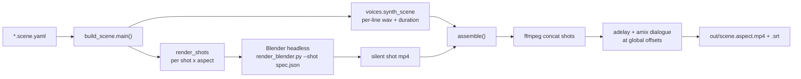
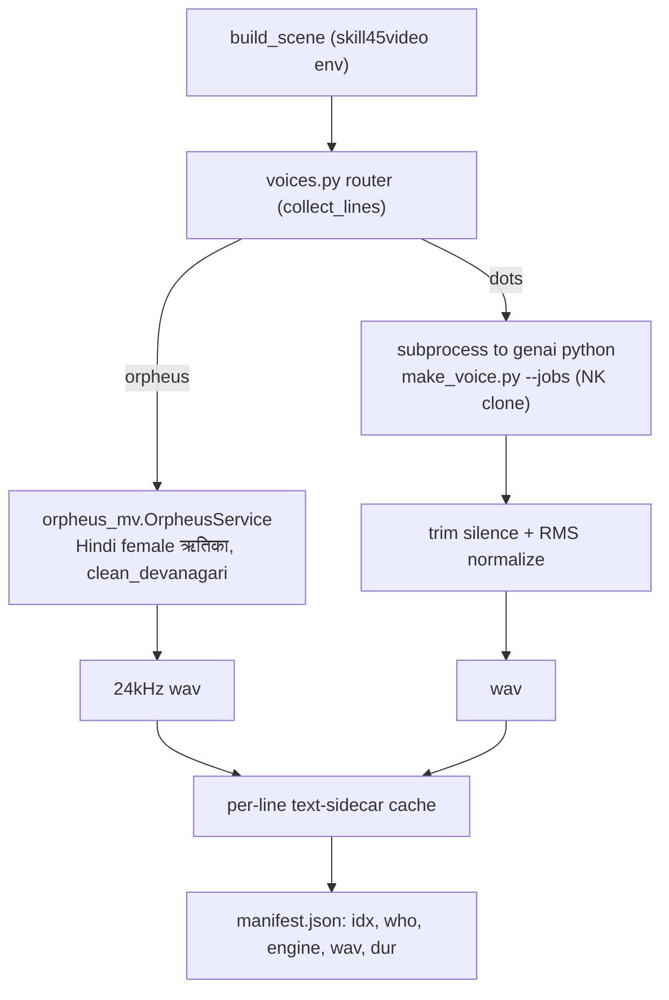
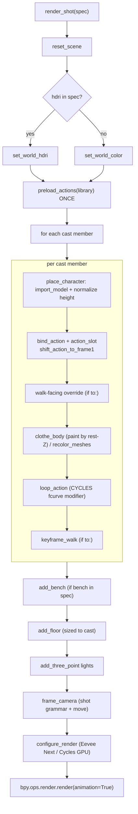
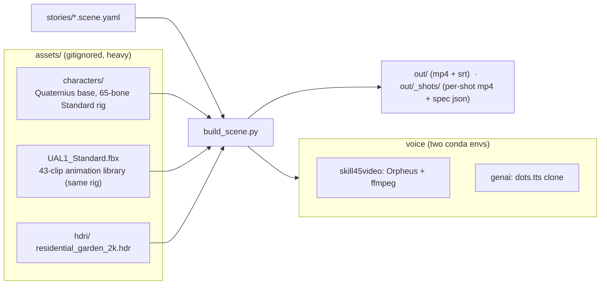

# anim-studio — Architecture (internal dev reference)

How a `*.scene.yaml` becomes a stitched, voiced video, headless on the GPU. This is the **3D analogue of
`skill45-video`**: the same `schema → render → voice → mux` contract, upgraded from 2D Manim to 3D
characters. Read alongside [`../scene.schema.md`](../scene.schema.md) (the input format) and the source
files named throughout.

> Mermaid blocks render natively on GitHub and in VS Code's Markdown preview (with the *Markdown Preview
> Mermaid Support* extension).

---

## 1. End-to-end pipeline

`build_scene.py` (run with the **skill45video** python) is the orchestrator. It synthesizes all voices
once, renders each shot × aspect through a headless Blender subprocess, then assembles with ffmpeg.

Key points:
- **Voices are synthesized first, once** — durations (via ffprobe) drive each shot's frame count
  (`shot_layout`), so timing is known before any frame renders.
- **Each shot is its own Blender process** (`render_shots` shells out per shot × aspect). Shots are
  rendered silent, then concatenated; dialogue is laid on afterward at cumulative global offsets.
- **`--only <shot_id>`** renders a single shot for fast iteration; **`--aspects 16x9`** overrides the
  scene's aspect list.

---

## 2. Two-env voice routing

Voice is the one place we deliberately span **two conda envs**, because the two models can't share one:
Orpheus runs in-process in `skill45video`; the dots.tts clone lives in `genai` (its own torch/CUDA stack)
and is driven as a subprocess. `voices.py` hides this behind one `synth_scene` call.

Key points:
- **Caching**: each line writes a `NN_who.txt` sidecar next to its wav. On re-run, a line is re-synthesized
  only if its wav is missing or the sidecar text differs — this avoids reloading the multi-GB models when
  only some dialogue changed.
- **Batched dots**: all dots lines of one language are written to `_dots_jobs.json` and generated in a
  single `make_voice.py --jobs` call → one model load per language group, not per line.
- **Devanagari rule**: Orpheus can't read Latin script, so English terms in HI lines are written in
  Devanagari (अपग्रेड/टेक/करियर…). `clean_devanagari` normalizes before synthesis.

---

## 3. `render_blender.render_shot` internals

The headless renderer. One shot-spec JSON (written by `build_scene.render_shots`) describes the world,
cast, positions, and camera. The order below is the actual call order inside `render_shot`.

Camera grammar (`frame_camera`): back-off distance = `maxdim * factor + 1.5`, where `factor` is
`medium 2.0 · two_shot 2.6 · wide 3.2 · over_shoulder 1.8 · hero 2.4`. `move: push_in` keyframes the camera
from ~1.12× to ~0.92× of that distance across the shot; otherwise static.

---

## 4. Asset & data model

Motion-source priority for a cast member's `action` (resolved in `build_scene._cast_spec`):
1. `motion_library` + `motion_map` → `"<library.fbx>#<ClipName>"` (Quaternius multi-clip file)
2. `assets/motions/<action>.fbx` (one clip per file, Mixamo style)
3. none → renderer falls back to the model's built-in clip / static pose

---

## 5. Key mechanisms & gotchas

- **Blender 4.4+ "slotted actions"** (`bind_action`) — assigning `armature.animation_data.action = act` is
  *not* enough; you must also set `animation_data.action_slot = act.slots[0]` or the channels never apply
  (characters render frozen in T-pose despite fcurves + matching bone names). This cost hours; it's the
  single most important gotcha here.
- **Clip → frame 1 shift** (`shift_action_to_frame1`) — Quaternius packs all 43 clips on one shared
  timeline, so an imported clip's keys sit at a high frame offset. Rendering frames 1..N would land before
  the clip and show a frozen pose; the shift moves each clip's keys to start at frame 1. Idempotent.
- **Preload once** (`preload_actions`) — the library FBX is imported a single time and its actions are kept
  alive with `use_fake_user`; per-character re-import would rename clips to `…Loop.001` and break the
  name→action lookup.
- **Height normalization** (`place_character`) — characters are parented under an Empty whose scale is
  `target_height / measured_height` (~1.7 m). Mixamo FBX often imports ~100× too large; this fixes it
  uniformly. All world-space measurements (clothing, bones) account for this empty scale.
- **Mesh-paint clothing** (`clothe_body`) — instead of adding garment geometry (floating boxes clip badly),
  we paint **the real skinned body mesh** into skin / shirt / lower material regions by **rest-pose Z**
  (thresholds from neck / pelvis / thigh / knee `head_local`). Because it's the actual body, clothing fits
  exactly and deforms with every pose. `baggy` puffs the clothed-region verts outward along their normals
  for a loose look — still no extra geometry. Arms fall in the torso band → they read as long sleeves.
- **Walk auto-facing** — a cast member with `to:` is oriented to its travel vector
  (`atan2(-dx, dy)`; convention: local +Y is forward, `face: 180` looks at camera) so it walks where it's
  going instead of sliding sideways. If a clip's forward axis isn't +Y, nudge the scene-level
  `walk_face_offset` (try `90` / `180` / `-90`).
- **Why two conda envs** — `genai` carries the dots.tts torch/CUDA stack; `skill45video` carries Orpheus,
  ffmpeg, numpy 2.2.6, manim. They don't co-install cleanly, so dots is always a subprocess bridge.

**Honest gaps (by design, not bugs):** hard cuts between shots (no continuous camera yet); **no lip-sync**
(M3 — mouths don't match words); bench seat-height is a fixed `0.45 m` that may need tuning to a given sit
clip; base bodies are recolored/painted, not textured.

---

## 6. File / function reference

| File (env) | Key functions | Role |
|---|---|---|
| `build_scene.py` (skill45video) | `main`, `render_shots`, `assemble`, `shot_layout`, `tag_dialogue_indices`, `_cast_spec` | Orchestrator: parse scene → synth → render each shot → concat + mux + SRT |
| `voices.py` (skill45video) | `synth_scene`, `collect_lines`, `synth_orpheus`, `synth_dots`, `_dur` | Voice router across the two envs; per-line wav + duration manifest, with cache |
| `make_voice.py` (genai) | `--text/--out` (single), `--jobs` (batch), `postprocess` | dots.tts generation in NK's cloned voice; trim silence + RMS-normalize |
| `render_blender.py` (Blender python) | `render_shot`, `place_character`, `bind_action`, `shift_action_to_frame1`, `preload_actions`, `clothe_body`, `recolor_meshes`, `add_bench`, `loop_action`, `keyframe_walk`, `frame_camera`, `configure_render`, `set_world_hdri` | Headless shot renderer (shot-mode). Also keeps M0 single-`--model` mode in `main`. |
| `orpheus_mv.py` (../skill45-video) | `OrpheusService`, `clean_devanagari`, `SR` | Reused as-is for the ऋतिका Hindi voice |

Run commands and prerequisites are in [`../README.md`](../README.md); the input format is in
[`../scene.schema.md`](../scene.schema.md).
