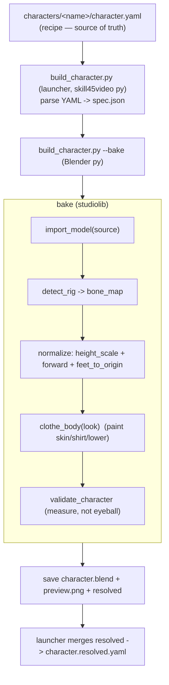
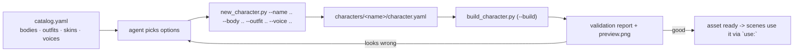

# Character pipeline (Component 1) + GUI inspection

How a raw downloaded model becomes a reusable studio character, and how to QA it in the Blender GUI.
Input format: [`../character.schema.md`](../character.schema.md). Shared helpers: [`ARCHITECTURE.md`](ARCHITECTURE.md).

## The component



**Why a recipe + a baked .blend.** The YAML recipe is what an AI edits; the `.blend` is the built artifact
the renderer links (already normalized + clothed → fast, no per-shot reprocessing). The renderer falls back
to importing the source model if the asset hasn't been baked yet, so nothing breaks pre-bake.

## How an AGENT builds a character (option-driven — the front door)
An agent never hand-crafts geometry. It **picks building blocks from a catalog**, generates the recipe,
and builds. The blocks live in [`../catalog.yaml`](../catalog.yaml): `bodies`, `outfits` (painted clothing
presets), `skins`, `voices`. Add more options there over time; ids stay stable.



```powershell
python new_character.py --list                 # discover bodies / outfits / skins / voices
python new_character.py --name riya --body female_base --outfit skirt_warm --skin light \
    --voice ritika_hindi --build               # write recipe + bake in one go (add --inspect for GUI)
```
The agent then reads the validation report + `preview.png` and, if something's off, re-picks options (or
edits the recipe) and rebuilds — a deterministic, headless loop. **Adding wardrobe later** = add an entry
under `outfits:` (or a clothed/textured body with `textured: true`); no code change.

## Run it (NK runs; per the hand-over rule)
Build (headless):
```powershell
cd "C:\Users\ZENITHRA_MK\Music\NK\Projects\anim-studio"
$env:PYTHONUTF8 = "1"
python build_character.py characters/riya/character.yaml
```
Build **and** open the result in the Blender GUI to inspect:
```powershell
python build_character.py characters/riya/character.yaml --inspect
```

The console prints a validation report:
```
  validation: OK
    [PASS] rig_present    Armature
    [PASS] bone_map       scheme=standard
    [PASS] height         1.701m (target 1.7)
    [PASS] feet_on_floor  min.z=0.002
    [PASS] has_mesh       1 mesh(es)
```
An AI reads this (and `preview.png`) and self-corrects the recipe if anything FAILs.

## GUI inspection tutorial (recommended QA workflow)
**We author in code; the GUI is only to confirm a built character looks right.** After `--inspect` opens
the baked `.blend` (or open `characters/<name>/character.blend` from Explorer):

1. **Check the clothing regions** — in the viewport top-right, switch shading to **Material Preview**
   (the third sphere icon). You should see the painted shirt / skirt-or-shorts / skin bands on the body.
2. **Confirm it's rigged & not stuck in a T-pose** — click the character, find the **Armature** in the
   Outliner, set the mode dropdown (top-left) to **Pose Mode**. Select a bone (e.g. an arm) and rotate
   (`R`) — the mesh should deform with it. (Motion clips are applied later, at render time.)
3. **Confirm size & feet on floor** — press **N** for the side panel → **Item** tab → with the character
   selected, read **Dimensions**: Z should be ≈ your `target_height` (1.7 m). The feet should sit on the
   world origin grid (z = 0).
4. **Turn observations into recipe edits** (then re-run the build):
   - body faces *away* from camera → change `forward:` (try `-Y`).
   - too tall / short → adjust `target_height`.
   - shirt band too high/low, or colors → tweak `look.clothes`.
   - floating above / sunk into the floor → that's the `feet_on_floor` check; tell me and I'll adjust the
     normalize step.

Close Blender when done — the studio never depends on the GUI staying open.

## Change clothes = swap a garment mesh (real clothing)
Painted outfits are just colored body regions. A **real** outfit is a garment *mesh* skinned to the **same
rig** as the body; we bind it to the body's armature (`studiolib.wardrobe.attach_garment`) so it deforms
with the existing animations — no re-weighting, no retargeting. "Change clothes" = pick a different garment.

The cleanest free source that fits our setup: **Quaternius Modular Character Outfits** (CC0) — rigged to the
*same Universal rig + Universal Animation Library* we already use.

**Download (NK runs — hand-over rule):**
1. Get **Quaternius Modular Character Outfits** (CC0): https://quaternius.com (or https://quaternius.itch.io).
   Grab the **FBX** (or glTF) version.
2. Put an outfit file in `assets/outfits/`, e.g. `assets/outfits/Outfit_A.fbx`.
3. Uncomment the `quaternius_outfit_a` entry in [`../catalog.yaml`](../catalog.yaml) and fix the filename.
4. Build a dressed character:
   ```powershell
   python new_character.py --name riya --body female_base --outfit quaternius_outfit_a --voice ritika_hindi --build --inspect
   ```
   The preview shows the body **wearing the real garment**; in a scene it deforms with the animation.
   **Swap clothes** = run again with a different `--outfit`. (The pack is fantasy-themed — fine to prove the
   mechanism; modern garments drop in identically.)

> Garment must be skinned to the Universal rig (matching bone names). If a garment imports at a different
> scale or clips badly, tell me and I'll add a per-garment scale/offset.

## Anime characters via VRoid Studio (.vrm) — the "cute face + hair + dress" path
The painted-nude-base look has a low ceiling. For real anime-style characters (face, hair, clothes,
toon textures), make them in **VRoid Studio** (free) and import the **.vrm** — the pipeline keeps the
VRoid materials (`textured: true`), so no painting.

**One-time setup (NK runs — hand-over rule):**
1. Install **VRoid Studio** (free): https://vroid.com/en/studio
2. Install the free **VRM Add-on for Blender**: https://vrm-addon-for-blender.info/en/
   — download the .zip, then in Blender: *Edit → Preferences → Add-ons → Install…* → pick the zip → tick it on.

**Per character:**
1. In VRoid Studio, design the character (face / hair / outfit) and **Export → VRM**. Save it into the
   character folder, e.g. `characters/riya/riya.vrm`.  (Or download a free ready-made VRM from
   https://hub.vroid.com / https://booth.pm and save it there.)
2. Add a body to [`../catalog.yaml`](../catalog.yaml) (uncomment & edit the `riya_anime` example): point
   `source:` at the `.vrm`, keep `textured: true`.
3. Build it:
   ```powershell
   python new_character.py --name riya --body riya_anime --voice ritika_hindi --build --inspect
   ```
   The preview shows the anime character with its own hair/face/clothes; `forward: -Y` if it faces away.

**Honest gap — motion:** a VRoid/VRM skeleton is NOT the Quaternius "Universal" rig, so our current
animation library won't drive it directly — animating a VRM needs a **retargeting** step (a separate
piece we'll add). So this gets the *look* now; making it act with our existing clips is the next problem.
(Alternatively, uploading the VRoid model to Mixamo auto-rigs it + gives Mixamo animations.)

## Notes / honest gaps
- The base bodies are **nude meshes**, so "clothing" is painted color regions (fits + deforms perfectly),
  not modelled garments or textures — that's a later upgrade.
- No face/lip-sync yet (M3).
- `bone_map` detection covers Quaternius 'Standard' and Mixamo 'mixamorig' naming; an unusual rig may need
  an explicit `bone_map:` in the recipe.
